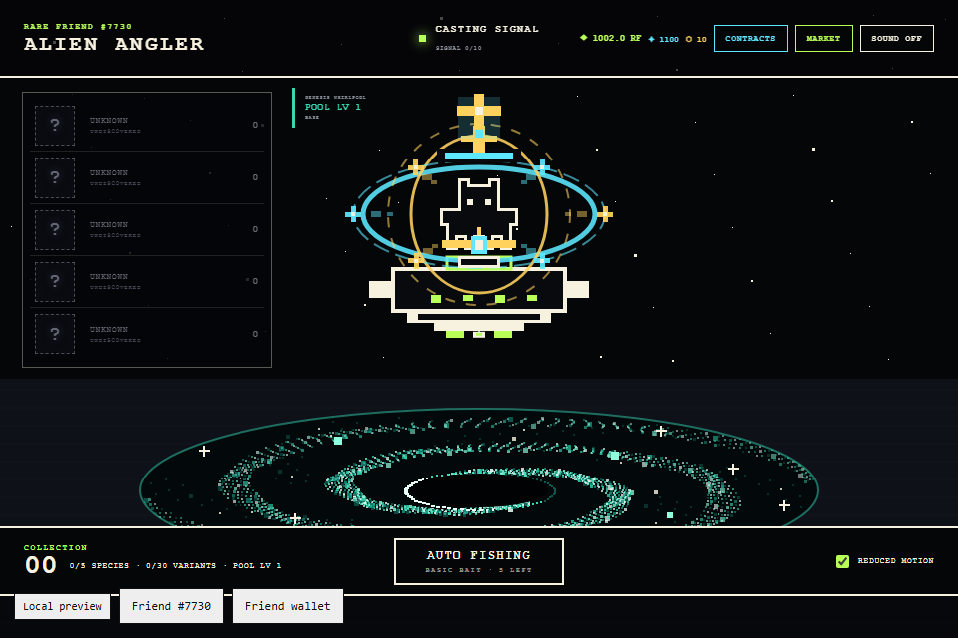

# Alien Angler

Alien Angler is a pixel-art idle fishing game where a selected Rare Friend sits
on a UFO and casts signals into animated galaxy pools to collect alien species,
variants and long-term mastery rewards.

**Vibeathon category:** Economy Potential  
**Builder:** [@Sugoi8130](https://github.com/Sugoi8130)  
**Playable preview:** <https://sugoi8130.github.io/alien-angler/>  
**Built with:** FriendSDK v0.1.3



## Play

The public preview requires a browser wallet on Robinhood mainnet holding a
hardwired Rare Friends Generations NFT, generation 1 or higher. The economy is
fully simulated: no RF funding, signature or real-money transaction is used.

1. Connect the wallet and select an eligible Rare Friend.
2. Start Auto Fishing or reel manually when the signal bites.
3. Spend simulated RF on bait, UFOs, galaxy pools and cosmetics.
4. Complete Daily Contracts, Weekly Constellations and 30-level Pool Mastery.
5. Collect Default, Shiny, Glitched, Baby, Cosmic and Seasonal alien variants.

## Run locally

Install Node.js 22+ and npm, then:

```bash
npm install
npm run dev
```

Open the URL printed by FriendSDK, normally <http://localhost:4173>.

Build and validate with:

```bash
npm run build
npm run check
npm test
```

The complete game rules, RF prices, reward odds, Stardust economy, mastery
milestones and known limitations are documented in
[`games/alien-angler/README.md`](games/alien-angler/README.md).

## Core economy

- Alien rarity odds: Normal 50%, Rare 30%, Epic 11%, Legendary 6%, Mythical 3%.
- Base RF rewards: 0.2 / 0.5 / 1 / 3 / 10 RF respectively, plus one-time
  discovery bonuses.
- Variant odds: Default 70%, Shiny 12%, Glitched 5%, Baby 8%, Cosmic 3%,
  Seasonal 2%. Variants do not alter RF rewards.
- RF is spent on consumable bait, cosmetics, UFOs and new pools.
- Stardust funds crafting, scanners, contract rerolls and cosmetic upgrades.
- Mystery Cosmetic Chests cost 250 Stardust and three fragments. Internally
  they award an unowned cosmetic 30% of the time and bait 70% of the time; the
  exact odds are intentionally hidden in the in-game shop to preserve surprise.

## Checks and limitations

- FriendSDK game validation and production build pass.
- Automated browser checks cover fishing, economy, Market layout, alien
  variants, Pool Mastery, contracts, Stardust Workshop, cosmetics and UFOs.
- Desktop and reduced-motion layouts have been visually checked.
- Progress, inventory and contracts reset when the preview session reloads.
- The prototype has no live token spending, redemption, trading or persistent
  save system.
- A real-wallet public-host playthrough remains recommended before production.

## Credits

Friend identity, wallet selection, canonical Friend sprites, runtime UI and
sound utilities come from [FriendSDK v0.1.3](https://github.com/spokesz/friendsdk),
licensed under Apache-2.0. Alien, UFO, galaxy-pool and interface artwork was
created specifically for Alien Angler.
